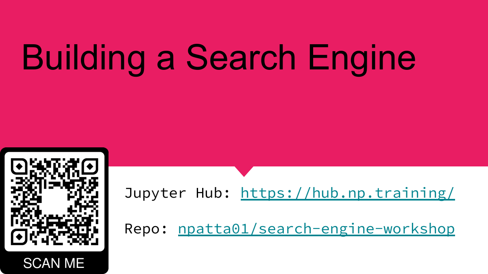
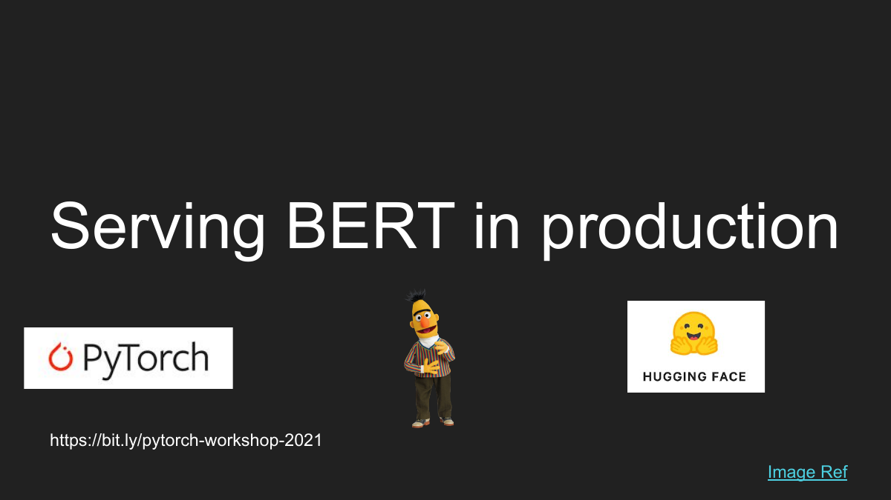

# Hi, I'm Nidhin 👋

I build machine-learning systems for search, recommendation, and AI agents.

My work spans retrieval, evaluation, and practical deployment.

I also enjoy turning what I learn into public talks, workshops, and reproducible projects.

## Current projects

### [Music-CRS 2026](https://github.com/npatta01/music-crs-2026)

A conversational music recommendation system that combines state extraction, multi-branch retrieval, rank fusion, learned reranking, and response generation.

[Project site](https://npatta01.github.io/music-crs-2026/) · [Architecture walkthrough](https://npatta01.github.io/music-crs-2026/docs/submission-architecture.html#/high-level-architecture) · [Paper](https://github.com/npatta01/music-crs-2026/blob/main/paper/main.pdf)

### [TREC RAG 2026](https://github.com/npatta01/trec_rag_2026)

An end-to-end retrieval and grounded-generation system, with accepted submission artifacts, architecture documentation, retrieval analysis, and citation-support evaluations.

[Project site](https://npatta01.github.io/trec_rag_2026/) · [Architecture report](https://npatta01.github.io/trec_rag_2026/reports/2026-competition-architecture.html) · [Evaluation reports](https://npatta01.github.io/trec_rag_2026/reports/)

### [Simple Deep Research](https://github.com/npatta01/simple-deep-research)

A hands-on LangGraph workshop that builds a Deep Research workflow step by step through notebooks, slides, and sample reports.

## Featured talks

### [Building a Search Engine — PyData Seattle 2023](https://www.youtube.com/watch?v=BvrOCq36SRs)

### [Serving BERT Models with TorchServe — PyData Global 2021](https://www.youtube.com/watch?v=sDGxzkOvxqY)

## Talks and workshops

### Search and retrieval

- [Building a Search Engine — PyData Seattle 2023](https://www.youtube.com/watch?v=BvrOCq36SRs)
- [Building a Semantic Search Engine — PyData NYC 2022](https://www.youtube.com/watch?v=oJjZNfmWg1Q)
- [Search Engine Workshop — notebooks and slides](https://github.com/npatta01/search-engine-workshop)
- [Improving Search Results Using Large Language Models — PyData Global 2023](https://github.com/npatta01/llm_search)
- [Improving Search Results Using RAG — workshop materials](https://github.com/npatta01/pydata_rag_video)

### ML systems and model serving

- [Serving PyTorch Models in Production — Data Umbrella 2022](https://www.youtube.com/watch?v=fx_NaKwFYbg)
- [Serving PyTorch Models in Production — PyData NYC 2022](https://www.youtube.com/watch?v=ujIqAZ8olAM)
- [Serving BERT Models with TorchServe — PyData Global 2021](https://www.youtube.com/watch?v=sDGxzkOvxqY)
- [Deploying a Mobile App on TensorFlow — PyData Global 2021](https://www.youtube.com/watch?v=tqk2eCsd_Fs)
- [Training and Deploying TensorFlow Models at Scale — San Diego Machine Learning 2022](https://www.youtube.com/watch?v=iBifBbgM2cg)
- [PyTorch Serving Workshop — notebooks and slides](https://github.com/npatta01/pytorch-serving-workshop)

### AI agents

- [Simple Deep Research with LangGraph — PyData 2025 workshop](https://github.com/npatta01/simple-deep-research)

## Project demo

- [Food Classifier Using fastai](https://www.youtube.com/watch?v=7d2qFLeYvRc)

## Find me

- [Portfolio and notes](https://npatta01.github.io/)
- [LinkedIn](https://www.linkedin.com/in/nidhinpattaniyil/)
- [Email](mailto:npatta01@gmail.com)
